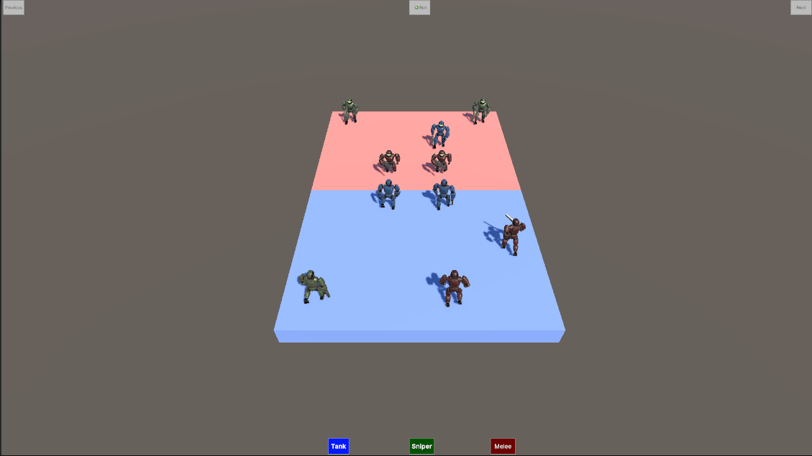
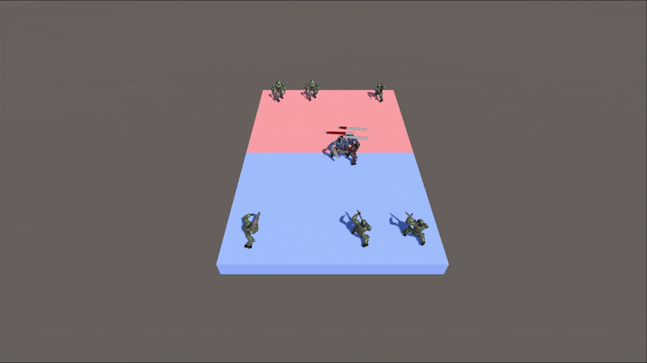
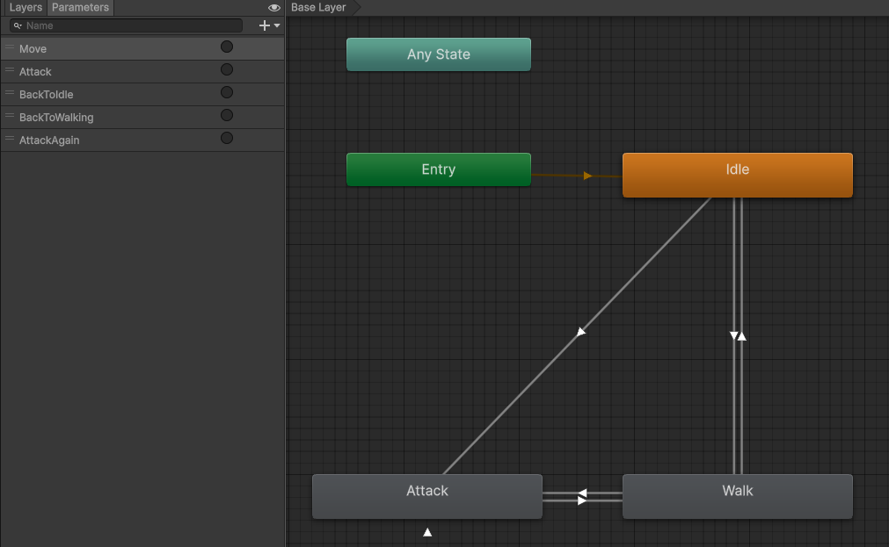
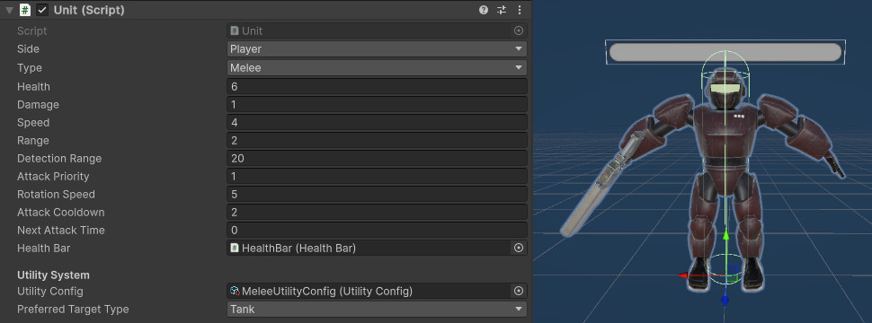
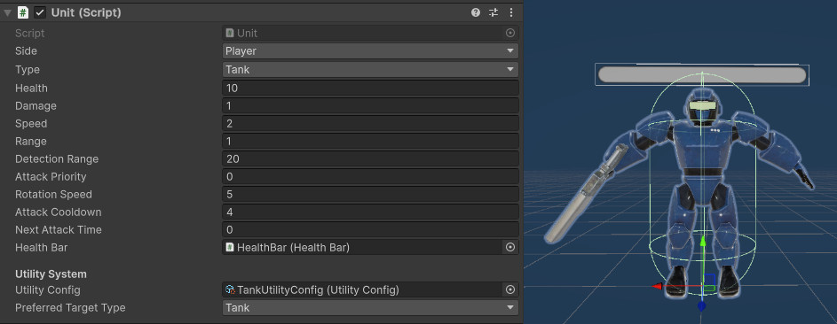
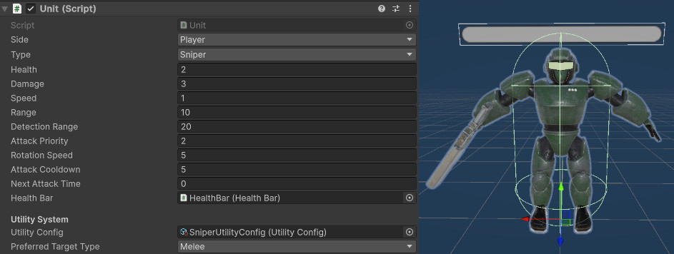

# Unity Tactical Combat System with Finite State Machine AI (TFT simulation)

A Unity tactical combat game utilizing an intelligent AI system built using Finite State Machines (FSM) and advanced target selection based on weighted utility decision making. This game project demonstrates intricate AI behavior beyond simple state transitions through the use of dynamic target prioritization and multi-level scene management.

## Project Overview

This tactical battle system drops units onto a grid battlefield where AI opposition makes smart movement, target choice, and combat engagement decisions. The innovation of the weighted utility system allows AI units to parse out several considerations when choosing targets, making more realistic and challenging combat simulations possible.



## Key Features

### Advanced AI Decision Making
The AI motor combines traditional FSM design with modern utility-based decision-making to facilitate units to:
- Weigh and rank multiple targets dynamically using weighted parameters
- Make context-dependent decisions considering distance, health, threat level, and unit type preference
- Switch seamlessly among various modes of behavior with continuous strategic knowledge

### Multi-Level Scene Management
The game supports multiple combat scenarios with:
- Dynamic level loading and unit spawning
- Auto scene cleanup and reset features
- Progressive challenge through varied enemy groups

### Animation Integration
Smooth animation system in sync with AI states:
- Hit-time accurate attack animations
- Visually responsive feedback to AI decision-making



## AI Architecture Deep Dive

### Finite State Machine Implementation

The AI engine revolves around a minimalist FSM architecture with four key states:

#### SeekState - The Intelligence Hub
The SeekState is the most sophisticated part of the AI system. Rather than being in a standard patrol state, this system uses an ongoing seeking mode that makes the AI more alive and responsive.

**Weighted Utility System**: This is where it gets magical. Rather than selecting the nearest enemy, the AI weighs out opportunities based on a number of weighted factors:

```csharp
private float CalculateUtility(Unit enemy)
{
    // Distance factor - closer enemies are generally more attractive
    float distance = Vector3.Distance(_unit.transform.position, enemy.transform.position);
    float distanceScore = 1 / (distance + 0.1f);

    // Health factor - wounded enemies are prioritized for finishing
    float healthScore = 1 - enemy.HealthPercentage;

    // Threat factor - dangerous nearby enemies get attention
    float threatScore = enemy.Damage / (distance + 0.1f);

    // Type factors - unit preferences and same-type avoidance
    float typeScore = 0;
    if (enemy.Type == _unit.preferredTargetType) 
        typeScore += _unit.utilityConfig.preferredTypeBonus;
    if (enemy.Type == _unit.Type) 
        typeScore += _unit.utilityConfig.sameTypePenalty;

    return (distanceScore * _unit.utilityConfig.distanceWeight) +
           (healthScore * _unit.utilityConfig.healthWeight) +
           (threatScore * _unit.utilityConfig.threatWeight) +
           typeScore;
}
```

This utility calculation creates emergent behavior where AI units self-organize fire onto damaged enemies, respond to immediate threats, and display tactical bias without direct programming for every scenario.

#### AttackState - Precision Combat
The AttackState coordinates the complex timing of animated combat, with:
- **Animation Synchronization**: The game waits for the exact point in the attack animation to apply damage, producing realistic combat timing
- **Cooldown Management**: Prevents unrealistic quick successive attacks without breaking combat flow
- **Range Validation**: Continuous check for whether targets are still in range, going back to seeking smoothly if they move out of it

#### IdleState and DieState
These states handle the beginning and end of unit lifecycles, with the IdleState as a safe default when there are no enemies in proximity, and the DieState handling proper unit removal.



### Weighted Behavior: The Science

Weighted utility as a system draws inspiration from the area of contemporary game AI research, and in particular from what has been achieved within strategy games like Total War and RTS games. The basic concept is that rather than having the AI make black-and-white decisions (attack this specific target), the AI weighs all options and rates them against a number of criteria.

**Mathematical Foundation**: Each potential target is given a utility score that aggregates normalized values on many different factors. Normalization avoids allowing any single factor to dominate the decision process, and the system automatically allows designers to adjust the personality and tactical preferences of the AI.

**Dynamic Adaptation**: Utility scores are recalculated automatically by the system, so AI action naturally reacts to dynamic battlefield circumstances without even needing to be told about state changes or complex conditional logic.

## Technical Implementation

### Grid-Based Architecture
The battlefield uses a tile-based setup that provides:
- Clear spatial organization for tactical gameplay
- Efficient collision detection and movement verification
- Visual confirmation of player unit location

### Scene Management System
The GameManager uses an advanced level system:
- **Dynamic Loading**: Levels are loaded without scene switches, saving game state
- **Unit Lifecycle Management**: Automated cleanups and spawning ensures clean level transitions
- **Progressive Difficulty**: Each level provides varying tactical challenges via varied unit compositions

### Animation Integration
The UnitAnimator system bridges the space between AI logic and graphical representation:
- **State-Synchronized Animations**: AI state changes automatically trigger matching animations
- **Accurate Timing**: Attack animations are synchronized with damage application for a silky-smooth combat feel
- **Seamless Transitions**: Switching among different animation states is natural and responsive





## Sources and Inspiration

This implementation takes inspiration from a diverse range of seminal sources in game AI research:

**Utility-Based AI**: The weighted decision-making framework is derived from Dave Mark's "Behavioral Mathematics for Game AI" and utility theory applications in games like The Sims, Civilization series, etc.

**FSM Architecture**: The state machine architecture is derived from paradigms in "AI for Game Developers" by David M. Bourg and Glenn Seemann, with modern Unity-specific twists.

**Tactical AI Design**: Target selection and priority system borrow ideas from AI design in "Game AI Pro" anthology, particularly work under tactical decision-making strategy game chapters.

**Animation Integration**: Synchronization of AI state with animations is done as per Unity's best practices as discovered in their official tutorials and guides for character controllers.

## How It All Comes Together

The beauty of the system is that these components work together to create emergent gameplay. A run-of-the-mill combat scenario would be something like this:

1. **Initialization**: Units are spawned and enter SeekState, immediately beginning to evaluate the battlefield
2. **Target Evaluation**: Units continuously rank all potential enemies with the weighted utility system
3. **Dynamic Adaptation**: When units take damage or move, utility scores change, causing AI to reallocate target priorities
4. **Combat Engagement**: Units change to AttackState as they close to attack range with precisely timed animations
5. **Tactical Flow**: Unit decisions aggregate to produce rich battlefield behavior without a single controller

## Future Improvements

The modularity of the system makes it easy to add new features:
- **Improved animation logic**: Using triggers is not ideal and can become pain for future use
- **Formation AI**: Units could be able to reposition for tactical reasons
- **Advanced Pathfinding**: Integration with Unity's NavMesh system for more complex battlefields
- **Environmental Factors**: Terrain effects and cover systems could add new variables to the utility calculations


## Conclusion

This project shows how traditional AI designs like FSMs can be enhanced with modern techniques to create more interactive and richer gameplay. The weighted utility system proves that simple mathematical concepts can display elaborate, realistic behavior if implemented well.

## Literature

[Improving AI Decision Modeling Through Utility Theory](https://www.gdcvault.com/play/1012410/Improving-AI-Decision-Modeling-Through)
[State pattern](https://gameprogrammingpatterns.com/state.html)
[Utility value analysis](https://www.awork.com/glossary/utility-value-analysis)


## Resources

[Model](https://assetstore.unity.com/packages/3d/characters/robots/robot-soldier-142438)
[Animations](https://assetstore.unity.com/packages/3d/animations/melee-axe-pack-35320)